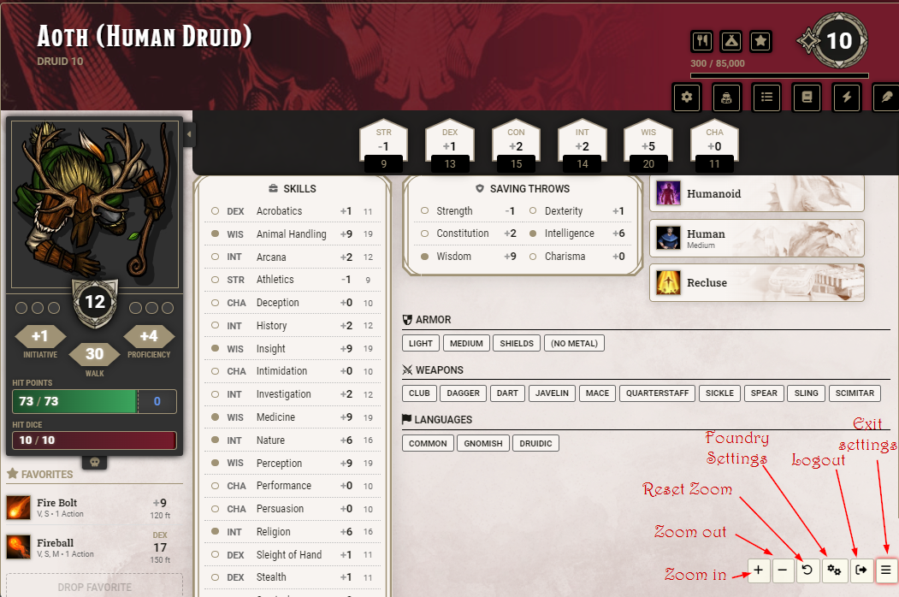
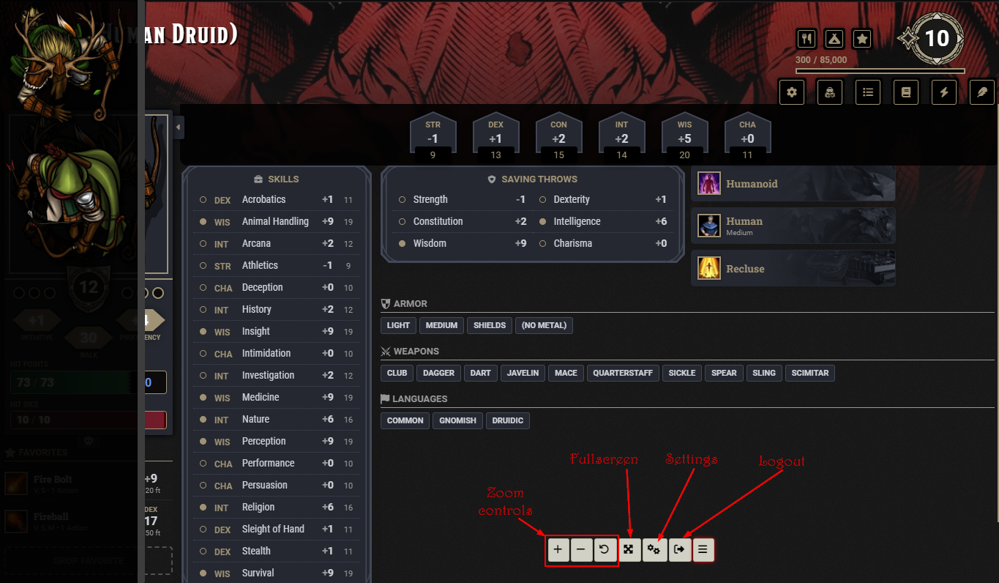

 

# FoundryVTT Sheet-Only
Designed for in-person sessions. Players can connect with their tablets to foundry and will see their character sheet and only their character sheet. 
They can interact with the sheet, see all the relevant information and the sheet gets updated if the GM makes any changes such as inventory, HP and so on.

I built this simple module for my own in-person sessions, where I have a large display to show foundry (using [Monk's Common Display](https://github.com/ironmonk88/monks-common-display))

My players used digital character apps (e.g. D&D beyond). The problem I had with this was that their information about 
their character and my information were not in sync. If they lost HP both sheets (external and foundry sheet) had to be updated. Adding new items was also a nuisance. With this module
I fixed that problem. Both, GM and players are looking and updating the same sheet now.

### Installation and setup
* Go to Settings -> Sheet-Only and select the players which should only see their character sheets
* There you can also set a screen-width so that this module only activates if the screen width it below a certain value
  * Let's say you want to use it only if you are logging in with your mobile. Set it to 800 (or whatever you mobile screen maximum width is) and you will see your sheet only if you are logged in with your mobile device
* There are also settings to change the default behaviour regarding notifications and the canvas

### Usage
* If sheet-only users log in they will only see their sheets
* If they have multiple characters, a sidebar is shown and the users are able to switch between characters
  * Works for companions and wild shapes (as long as the user has owner permission)

#### Zooming
* In the bottom right corner there are buttons to resize the UI. Depending on the browser you are using it works differently
  * Firefox: If you are using firefox, only the font size gets adjusted (like you would in the core setting) and therefore does only work with sheets that uses relative font-size units (rem instead of px). A working example is the default sheet of [Level Up: Advanced 5th Edition (Official)](https://foundryvtt.com/packages/a5e)
  * Non-Firefox: Taking advantage of the 'zoom'-property, this should zoom in and out quite nicely regardless of the font size units

#### Actor List
* If you own more than one actor a button at the bottom right can be used to toggle a list of all your actors
* If you don't have more than one actor, this button does nothing

### Tested with
- [Cyberpunk RED](https://foundryvtt.com/packages/cyberpunk-red-core) (Little wonky though)
- [Das Schwarze Auge / The Dark Eye (5th Edition)](https://foundryvtt.com/packages/dsa5)
- [DnD5e](https://foundryvtt.com/packages/dnd5e)
- [Level Up: Advanced 5th Edition (Official)](https://foundryvtt.com/packages/a5e)

### Issues
* The UI is not very reactive. If you go from portrait to landscape or vice versa you probably need to reload
* Changing the permission on an actor does not get synced with connected users
* On some systems (e.g. TDE5e, Cyberpunk Red) Dice So Nice! doesn't show roll if the canvas is disabled. To make it work again, uncheck "Disable Canvas for users" in Sheet-Only settings  

### Support
If you like to support my work . I really appreciate it!
