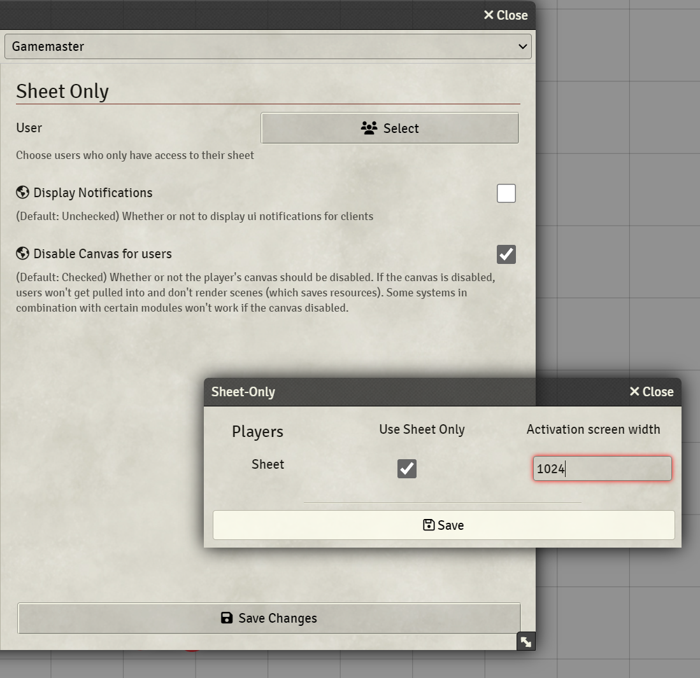

 

# FoundryVTT Sheet-Only
Designed for in-person sessions. Players can connect with their tablets to foundry and will see their character sheet and only their character sheet. 
They can interact with the sheet, see all the relevant information and the sheet gets updated if the GM makes any changes such as inventory, HP and so on.

I built this simple module for my own in-person sessions, where I have a large display to show foundry (using [Monk's Common Display](https://github.com/ironmonk88/monks-common-display))

My players used digital character apps (e.g. D&D beyond). The problem I had with this was that their information about 
their character and my information were not in sync. If they lost HP both sheets (external and foundry sheet) had to be updated. Adding new items was also a nuisance. With this module
I fixed that problem. Both, GM and players are looking and updating the same sheet now.

### Installation and setup
* After activating the module a new scene gets created. To this scene all the sheet-only-users will be re-directed 
* Go to Settings -> Sheet-Only and select the players which should only see their character sheets.

### Compatibilities
Should work with 
[Tidy5e Sheet](https://foundryvtt.com/packages/tidy5e-sheet/)
[Compact DnDBeyond 5e Character Sheet](https://foundryvtt.com/packages/compact-beyond-5e-sheet)